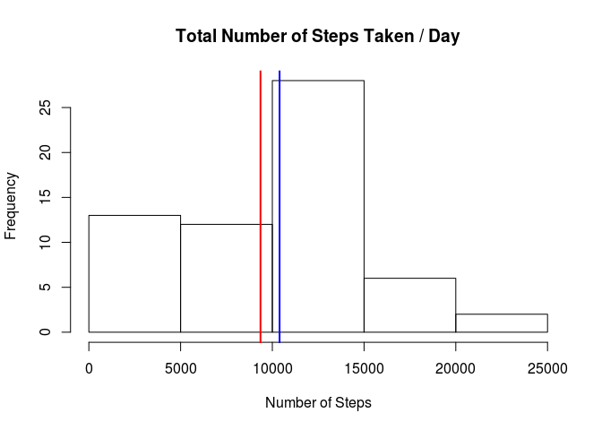
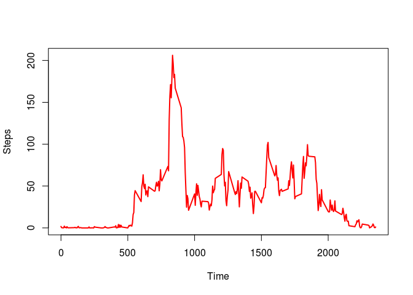
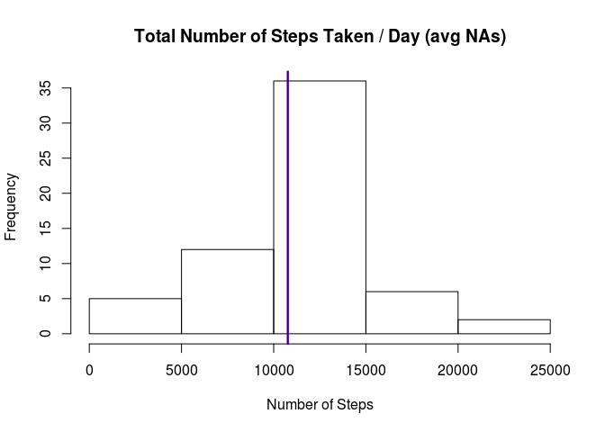
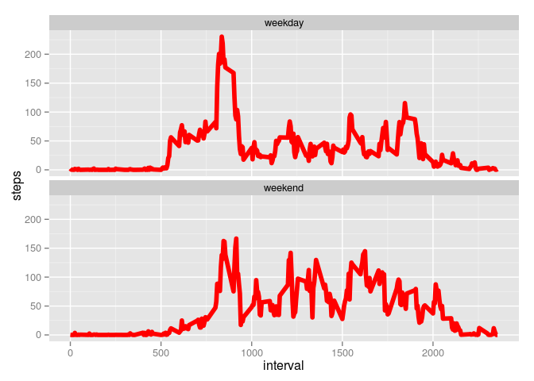

# Reproducible Research: Peer Assessment 1

## Introduction
It is now possible to collect a large amount of data about personal movement using activity monitoring devices such as a Fitbit, Nike Fuelband, or Jawbone Up. These type of devices are part of the "quantified self" movement -- a group of enthusiasts who take measurements about themselves regularly to improve their health, to find patterns in their behavior, or because they are tech geeks. But these data remain under-utilized both because the raw data are hard to obtain and there is a lack of statistical methods and software for processing and interpreting the data.

This assignment makes use of data from a personal activity monitoring device. This device collects data at 5 minute intervals through out the day. The data consists of two months of data from an anonymous individual collected during the months of October and November, 2012 and include the number of steps taken in 5 minute intervals each day.

## Data

Data comes from the activity monitors at intervals of 5 minute. The variables included in this dataset are:

* steps: Number of steps taking in a 5-minute interval (missing values are coded as NA)
* date: The date on which the measurement was taken in YYYY-MM-DD format
* interval: Identifier for the 5-minute interval in which measurement was taken

The dataset is stored in a comma-separated-value (CSV) file and there are a total of 17,568 observations in this dataset.

## Loading and preprocessing the data

```r
unzip("activity.zip")
dd = read.csv("activity.csv")
```

## What is mean total number of steps taken per day?

We can answer the question by showing a histogram. We have added two vertical lines:

* Mean: red
* Median: blue


```r
# We first get the sum of the steps by date
sumsteps <- tapply(dd$steps,dd$date,sum, na.rm=TRUE)

#  We calculate the mean and median
mn <- mean(sumsteps, na.rm = TRUE)
md <- median(sumsteps, na.rm = TRUE)

# Now we paint the histogram
hist(sumsteps,
     main = paste("Total Number of Steps Taken / Day"), 
     xlab="Number of Steps")

# Draw mean line in red
abline(v=mn, col="Red", lwd=2)

# Draw median line in blue
abline(v=md, col="Blue", lwd=2)
```

\


```r
print(paste("Mean: ", mn))
```

```
## [1] "Mean:  9354.22950819672"
```

```r
print(paste("Median: ", md))
```

```
## [1] "Median:  10395"
```

## What is the average daily activity pattern?

To calculate this we will make a time series plot of the 5 minute interval on the x-axis, and the average number of steps taken, averaged across all days on the y-axis.


```r
# Aggregate steps by day
aggd <- aggregate(x = list(steps=dd$steps), by=list(interval=dd$interval), mean, na.rm=TRUE)
plot(aggd$interval, aggd$steps, type = "l", col="red", lwd=2, xlab="Time", ylab="Steps")
```

\


```r
mx <- max(aggd$steps)
interv <- aggd$interval[which.max(aggd$steps)]

print(paste("The maximum value was", mx, 
            "and happened in the 5 min interval number", interv, "."))
```

```
## [1] "The maximum value was 206.169811320755 and happened in the 5 min interval number 835 ."
```
## Imputing missing values

To calculate this, we need to calculate the total number of missing values to devise a strategy to fill the NAs.


```r
miss <- is.na(dd)
table(miss)
```

```
## miss
## FALSE  TRUE 
## 50400  2304
```

We see that there are 2304 missing values. We choose to fill the NAs with the mean for that interval.


```r
dd_fill <- dd
dd_fill$steps[which(is.na(dd_fill$steps))] <- tapply(dd_fill$steps, dd_fill$interval, mean, na.rm=TRUE)
```

And now we create the histogram of the new data set the same way we did previously:


```r
# We first get the sum of the steps by date
steps <- tapply(dd_fill$steps, dd_fill$date, sum, na.rm=TRUE)

#  We calculate the mean and median
mn <- mean(steps, na.rm = TRUE)
md <- median(steps, na.rm = TRUE)

# Now we paint the histogram
hist(steps,
     main = paste("Total Number of Steps Taken / Day (avg NAs)"), 
     xlab="Number of Steps")

# Draw mean line in red
abline(v=mn, col="Red", lwd=2)

# Draw median line in blue
abline(v=md, col="Blue", lwd=2)
```

\


```r
print(paste("Mean: ", mn))
```

```
## [1] "Mean:  10766.1886792453"
```

```r
print(paste("Median: ", md))
```

```
## [1] "Median:  10766.1886792453"
```

On the fixed dataset, the mean and median are exactly the same value.

## Are there differences in activity patterns between weekdays and weekends?

First we will create a new factor variable in the dataset with two levels, "weekday" and "weekend", indicating whether a given date is a weekday or weekend day. 


```r
dd_fill$date <- as.Date(dd_fill$date)
dd_fill$dayname <- weekdays(dd_fill$date)
dd_fill$daytype <- c("weekday")
dd_weekdays <- dd_fill[(!dd_fill$dayname %in% c("sábado", "Saturday", "domingo", "Sunday")),]
dd_weekdays$daytype <- c("weekday")
dd_weekends <- dd_fill[(dd_fill$dayname %in% c("sábado", "Saturday", "domingo", "Sunday")),]
dd_weekends$daytype <- c("weekend")
dd_final <- rbind(dd_weekdays, dd_weekends)

# Check the days that are weekeds and weekdays
table(dd_final$daytype=="weekend")
```

```
## 
## FALSE  TRUE 
## 12960  4608
```

Now we convert the daytype field into a factor and paint the graphic.


```r
dd_final$daytype <- factor(dd_final$daytype)
agg <- aggregate(dd_final$steps, list(interval = dd_final$interval, daytype=dd_final$daytype), mean)
names(agg) <- c("interval", "daytype", "steps")

library(ggplot2)
ggplot(agg, aes(interval, steps)) + geom_line(color = "Red", lwd = 2) + facet_wrap(~daytype, ncol=1)
```

\
